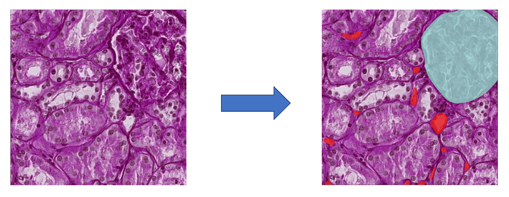

<!-- _class: title -->
<!-- _paginate: false -->
<!-- _footer: "" -->

# Marp生成サンプル
## HuBMAP - Hacking the Human Vasculature   Kaggleコンペ ソリューションまとめ

ベースはこれ。雑に再編集をかけました。：
[リンク](https://speakerdeck.com/sugupoko/20250515-jin-geng-nagara2023nian-nican-jia-sitahubmapjin-soriyusiyonmatome)

---

# 結果

**初めての金メダル。10位 / 1064チームでゴールド獲得。**

10位 / 1064チーム

Gold メダル獲得

| 項目 | 内容 |
|------|------|
| アプローチ | YoloV7-seg + 疑似ラベル + パラメータ調整 |
| ポイント | データの扱い ＞ モデルの組み合わせ |

---

# コンペ概要

**腎臓組織画像から微小血管構造をインスタンスセグメンテーションするコンペ**

### タスク
- 2次元PAS染色組織画像が入力
- 毛細血管・細動脈・細静脈などの微小血管をセグメンテーション
- 血管の検出結果のみがスコアリング対象

### 背景
- VCCFの改善が目的
- 微小血管の知識にはまだ不明点が多い

### 評価指標
- **Average Precision**（IoU ≥ 0.6）
- 正解マスクと6割以上重なっていれば検出とみなす
- 検出できている割合がスコアになる

---

# 配布データの構成

**14の病理サンプル × 2種類のアノテータ + ラベル無しで構成。 データの扱いがコンペ最大のポイント。**

| データ区分 | アノテータ | 枚数 | 備考 |
|-----------|-----------|------|------|
| 学習データ | 専門家ラベル | 422枚 | 高品質だが少量 |
| 学習データ | 一般人ラベル | 1,011枚 | 品質にばらつき |
| 学習データ | ラベル無し | 5,400枚 | 活用方法が鍵 |
| テストデータ | 専門家 | ???枚 | Kaggleシステムで非公開 |

各病理サンプルは大きい画像を512×512に分割して配布。全14種のうち学習データは一部のみ。

---

<!-- _class: section -->

# ベースライン & アプローチ紹介

---

# ベースライン：YoloV7-seg

**物体検出のYOLOシリーズを拡張したインスタンスセグメンテーションモデルを使用**

### YOLOv7とは
- 物体検出で定評のあるYOLOシリーズの一つ
- 速度と精度のバランスに優れる
- YOLOv7-segはセグメンテーション拡張版

### ベースラインの学習方法
- 専門家 + 一般人ラベルの1,433枚を全て学習
- 画像サイズは512×512のまま

### アーキテクチャ
- 3段階のピラミッド構造
- 入力画像に対して1/4サイズでマスク生成

---

# ベースラインの課題

**検出精度が低い＆そもそも検出できていないという2つの課題があった**

### 課題①：検出精度が低い
**推定原因：**
- 一般人ラベラーの品質が低く悪影響
  - 専門家はunsureラベルを付与、一般人はunsureが少ない
  - 一般人は異なるモノを血管としてアノテーション
- YOLOの入力画像サイズが小さい
  - 1/4サイズのマスクで小さい血管が消失

### 課題②：そもそも検出できない
**推定原因：**
- 病理サンプル1〜4のみでは学習ドメインが狭い
- 未知のテストデータで性能が出ない
- T-SNEで可視化すると、未ラベルデータは学習データと異なる領域に分布

---

# 最終ソリューション

**疑似ラベルによるラベル無しデータ活用 + YOLOパラメータ調整が差異化ポイント**

### 差異化ポイント①：疑似ラベル
- 半教師あり学習の技術
- ラベル無しデータを活用して性能向上

### 差異化ポイント②：パラメータ調整
- 入力解像度を512→640に変更
- 小さい物体の消失リスクに対応

### 推論時の工夫
- NMSコードを修正し、選択されたFoldのマスクを活用
- 後処理：connected componentで最大マスクのみ保持
- Dilationは使用しない（後述）

---

# 疑似ラベルを使った多段階学習フロー

**広いドメインで事前学習 → 専門ラベルで仕上げ、を多段で実施**

### 1段階目：疑似ラベル付け準備
1. 一般人ラベルで事前学習（1fold, 100ep）
2. 専門ラベルでFinetuning（5fold, 100ep）
3. 未ラベルデータを予測 → 疑似ラベル生成
   - Conf > 0.5（インスタンス）
   - 平均Conf > 0.6（タイル）で選定

### 2段階目：提出モデル作成
1. 疑似ラベルで事前学習（1fold, 100ep）
2. 専門ラベルでFinetuning（5fold, 100ep）
   → **最終提出モデル**

---

# YOLOパラメータ調整

**入力解像度を512→640に変更し、小さい血管の消失リスクに対応**

### 変更内容
- 配布画像は512×512だが、640×640にリサイズして推論
- 一見意味なさそうだが効果あり

### 理由
- YOLOv7は入力を1/4に縮小してマスク生成
- 512入力 → 128マスク → 小さい血管が消失
- 640入力 → 160マスク → 小さい血管を保持

### 推論パラメータ

| パラメータ | 値 |
|-----------|-----|
| Resolution | 640 |
| Conf threshold | 0.001 |
| IoU threshold | 0.55 |
| Folds | 0, 1, 4 |
| Dilation | 使用しない |
| 後処理 | 最大マスク保持 |

---

# 上位陣との共通ポイント

**コンペの勝敗を分けたのは、Clean Dataを見つける・作成する能力**

### Dilationの罠
- コンペ中、Dilation処理で性能向上という情報が流通
- しかし結果的にDilation使用者はランキングダウン
- 画像端での漏れ補完に効いていただけとの推測

### データセットの信頼性判断
- 上位陣は一般人ラベルの不確かさを正しく見極めていた
- Pseudo Labeling（疑似ラベル）で付け直す処理が共通
- **結論：データの扱い ＞ モデルの組み合わせ**

---

# 入賞に必要だったもの

**さらに上位に行くには、複数モデルのアンサンブルが必要だった**

| 順位 | 手法 |
|------|------|
| **我々（10位）** | YOLOv7のみ |
| **3位** | ViT、CBNetV2、ResNext101D などのアンサンブル |
| **4位** | MaskRCNN、CascadeRCNN、HTC、YOLOv6 のアンサンブル |

→ 単一モデルでの限界。複数アーキテクチャの組み合わせがトップ入りの条件。

---

# うまくいかなかったこと・やれなかったこと

**試行錯誤の中で、効果がなかったもの・実現できなかったものも多い**

### うまくいかなかった
- 疑似ラベル付与を2周実施
- YOLOv8での学習・推論
- NMS → WBF への変更

### うまく実装できなかった
- タイルを結合して再生成したデータでの学習

### やれなかった
- Stain toolによるデータ水増し
- 外部データを使った学習

### 提出できなかった最高性能モデル
- 入力解像度を800まで上げたモデル
- 小さい認識結果の影響度が高かった可能性

---

# 参考にした関連コンペ

**過去コンペのソリューションが、疑似ラベル戦略の着想源になった**

| コンペ | 参考にしたポイント |
|--------|-------------------|
| **Global Wheat Detection**（物体検出） | 疑似ラベル付与の手法 |
| **Sartorius - Cell Instance Segmentation**（インスタンスセグ） | 疑似ラベル + 最後のファインチューニングの思想 |

---

<!-- _class: summary no-lead -->

# まとめ

&nbsp;

###

- **順位**: 10位 / 1064チーム（ゴールド）
- **手法**: YoloV7-seg + 疑似ラベル + パラメータ調整
- **最大の学び**: データの扱い ＞ モデルの組み合わせ
- 専門ラベル・素人ラベル・未ラベルの使い分けがポイント
- 疑似ラベルで良質なデータを選定する戦略が性能に直結
- 上位に行くにはアンサンブルが必要だった
- 所感: モチベーションコントロールが課題。過去コンペのソリューション参考の重要性を再認識
